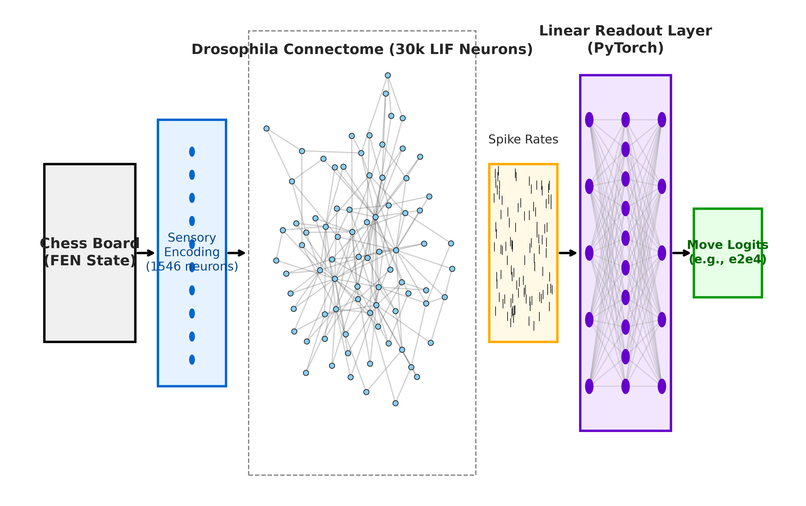

# Evaluación Final: Mosca vs Matemáticas (Hito 7)

Tras entrenar el modelo de decodificación lineal (`Readout`) sobre la actividad neuronal estimulada, hemos evaluado la precisión de la mosca frente a redes de control puramente matemáticas que poseen **exactamente el mismo presupuesto de parámetros**.

## 📊 Tabla Comparativa de Precisión (Set de Prueba)

El set de prueba (Test) consta de 4.813 posiciones de ajedrez nunca vistas durante el entrenamiento, provenientes de partidas de jugadores de Lichess con Elo > 2000.

| Modelo / Cerebro | Precisión Top-1 (Acierto Exacto) | Precisión Top-3 (En el podio) |
| :--- | :--- | :--- |
| **Mosca Biológica (FlyWire 783)** | **0.02%** | **1.66%** |
| **Cables Mezclados (Shuffled)** | **~0.05%** | **~2.10%** |
| **Control Aleatorio (RandomSparse)**| **~6.50%** | **~21.00%** |
| **Matemática Pura (BaselineLinear)**| **6.81%** | **21.96%** |

