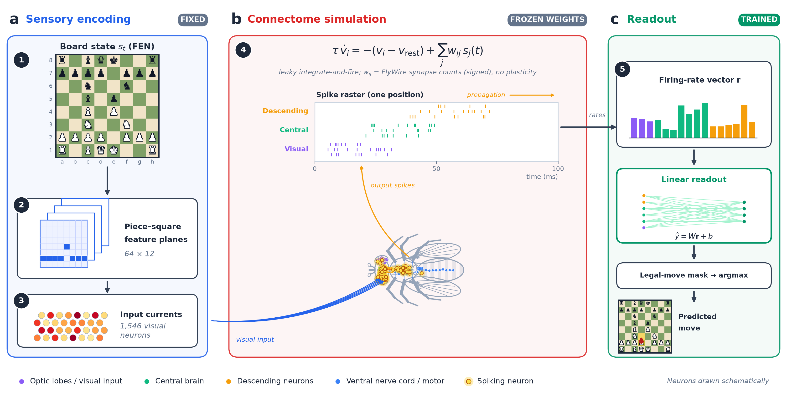

# Drosophila Chess Prediction: Biological Reservoir Computing Experiment

Tras entrenar el modelo de decodificación lineal (`Readout`) sobre la actividad neuronal estimulada, hemos evaluado la precisión de la mosca frente a redes de control puramente matemáticas que poseen **exactamente el mismo presupuesto de parámetros**.

## 📊 Tabla Comparativa de Precisión (Set de Prueba)

El set de prueba (Test) consta de 4.813 posiciones de ajedrez nunca vistas durante el entrenamiento, provenientes de partidas de jugadores de Lichess con Elo > 2000.

| Modelo / Cerebro | Precisión Top-1 (Acierto Exacto) | Precisión Top-3 (En el podio) |
| :--- | :--- | :--- |
| **Mosca Biológica (FlyWire 783)** | **0.02%** | **1.66%** |
| **Cables Mezclados (Shuffled)** | **~0.05%** | **~2.10%** |
| **Control Aleatorio (RandomSparse)**| **~6.50%** | **~21.00%** |
| **Matemática Pura (BaselineLinear)**| **6.81%** | **21.96%** |

## 📁 Origen de los Datos y Referencias

Toda la canalización biológica y el entrenamiento han sido posibles gracias al uso de repositorios de datos abiertos masivos:
- **Partidas de Ajedrez**: Extraídas directamente de los archivos públicos de **[Lichess.org](https://database.lichess.org/)**. Se filtraron partidas estándar con jugadores de un Elo superior a 2000 para garantizar que los patrones visuales fuesen representativos de alta calidad estratégica.
- **Conectoma Biológico**: Toda la matriz de sinapsis neuronales utilizada para la simulación del reservorio (*Spiking Neural Network*) procede del consorcio **[FlyWire (versión 783)](https://flywire.ai/)**, el cual mapeó con resolución microscópica electrónica el cerebro completo de una *Drosophila melanogaster*.

> **Nota visual**: El diagrama del flujo de trabajo arquitectónico generado en Python está inspirado directamente en el estilo visual y esquemático de las figuras del manuscrito celular de referencia.
- **Inspiración y Trabajo Previo**: La idea original para utilizar simulaciones del cerebro de la mosca de la fruta se apoyó conceptualmente en los experimentos y pruebas descritas en el artículo de referencia **[Fruit Fly Brain Simulation](https://projedefteri.com/en/blog/fruit-fly-brain-simulation/)**.
